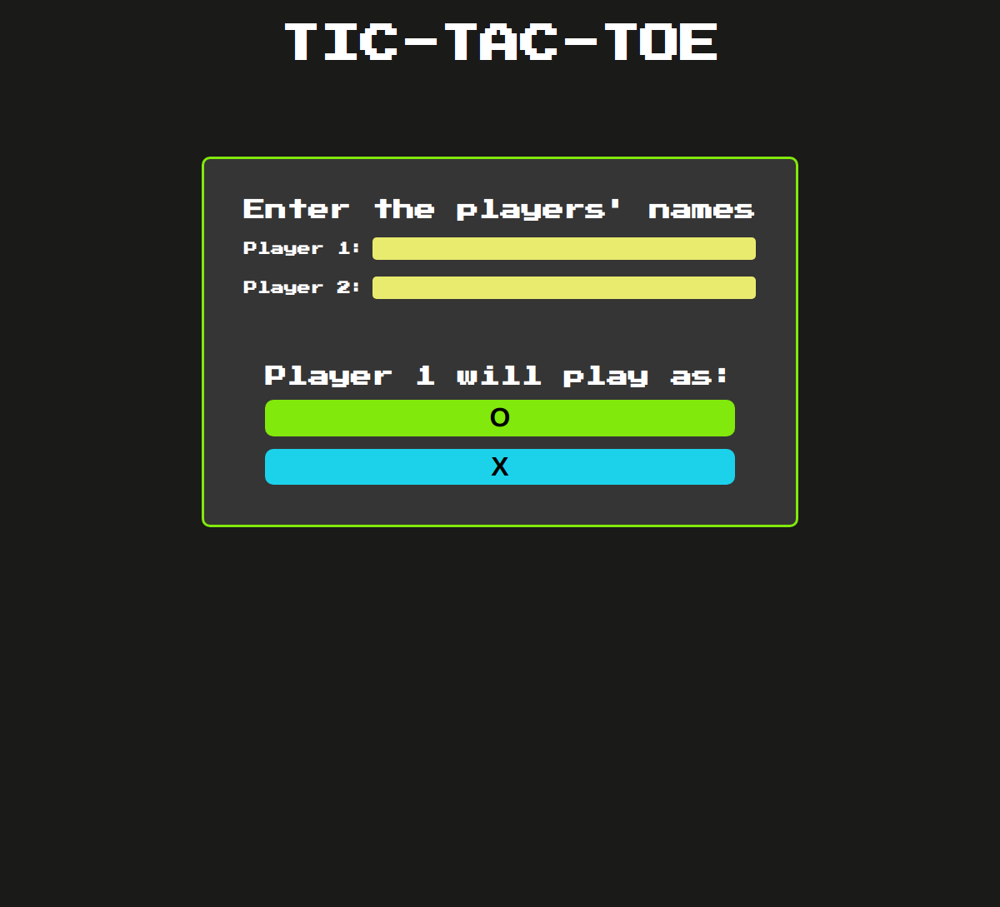
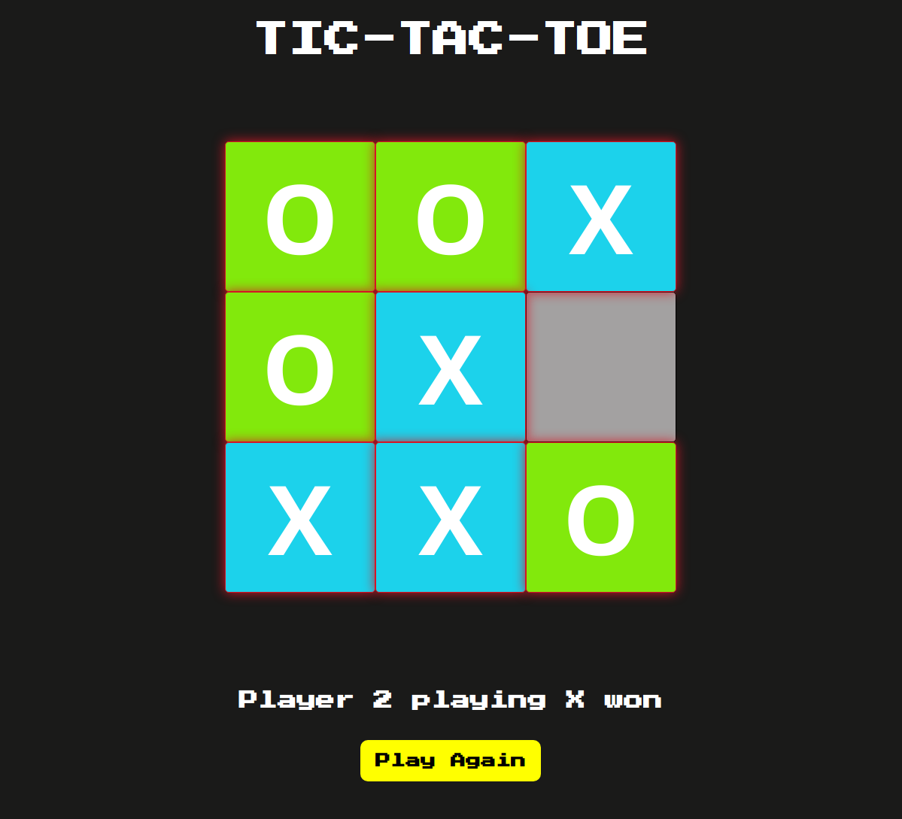
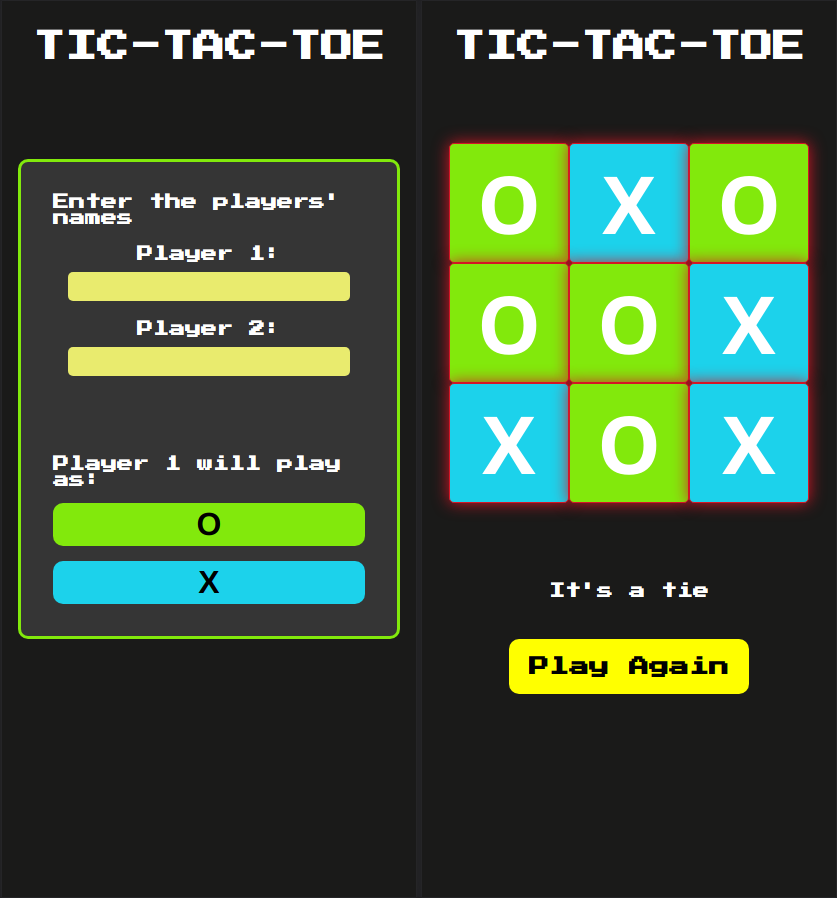

# Odin Project #9: Tic Tac Toe

The goal of this Odin Project assignment was to create a Tic Tac Toe game.

I started and finished this project in August 2022.

## Assignment

[The Odin Project - JavaScript - #9 Tic Tac Toe](https://www.theodinproject.com/lessons/node-path-javascript-tic-tac-toe)

## Technology

- HTML
- CSS
- Vanilla JavaScript

## Key Concepts

- Module Design Pattern
- Factory Functions
- Arrays & Objects
- Scope

## Links

[Live Demo](https://bn7631-odin-tic-tac-toe.pages.dev)

## Screenshots

### Desktop





### Mobile



## Font source

- https://fonts.google.com/specimen/Press+Start+2P

## Deployment

```bash
  git clone https://github.com/BrightNeon7631/odin-tic-tac-toe.git
```
